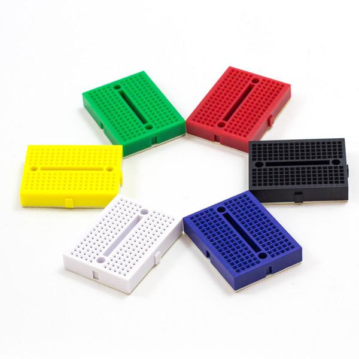

# Nightlight

## Description

Create an interactive night light. At minimum it will turn on in the dark and off in the light. A touch sensor will allow the user to turn the lights on or off manually. Use an Arduino with 6 LEDs, a photoresistor, and a capacitive sensor. Consider the night light as a complete object. What will be its environment? Who will use it? How will it be used? What does it look like and why?

Design Criteria:
 + Appearance
 + Construction
 + Interactivity / usability

[Emerging Objects | Flickr - Photo Sharing!] (https://www.flickr.com/photos/sparkle_labs/albums/72157633249013685)

**Form:**
3”x3”x3” cube laser cut acrylic

**Input:**

+ Capacitive touch sensor [Arduino Playground - InterfacingWithHardware] (http://playground.arduino.cc/Main/InterfacingWithHardware#capsens)
+ Light Sensor

**Output:** 1-6 LEDs

**Parts List:**

1. 10kΩ
2. 1MΩ
3. Resistors for LEDs. ~100Ω - 220Ω
4. Mini Breadboard
5. Arduino UNO
6. LEDs
7. Photoresistor
8. Length of wire (22 gauge) for capacitive touch sensor
9. Acrylic to create enclosure
8. Acrylic cement and applicator

![image] (acryliccement.jpg)
